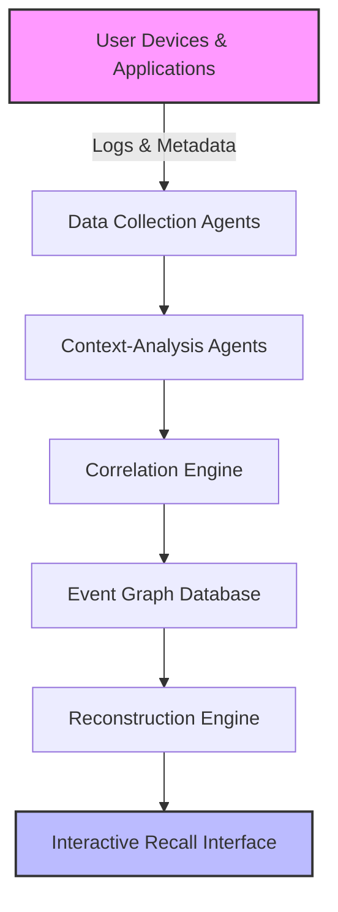

## 4. Detailed System Components

### 4.1. Autonomous Agents  

| Agent Type | Primary Role | Data Sources |
|------------|--------------|--------------|
| **Data Collection Agents** | Continuous harvesting of activity fragments | Email clients (SMTP/IMAP), file systems, cloud‑sync folders, web browsers (history, tabs, cookies), application logs (IDE, multimedia tools) |
| **Context‑Analysis Agents** | Metadata extraction & lightweight NLP for semantic cues | Same sources as collection agents; extracts timestamps, participants, file types, subject lines, document titles |

### 4.2. Correlation Engine  

| Analysis Module | Function | Techniques |
|----------------|----------|------------|
| **Temporal Proximity Analysis** | Groups events occurring within configurable windows (e.g., ±5 min) | Sliding‑window clustering, time‑series segmentation |
| **Semantic Similarity Modelling** | Quantifies meaning overlap between textual artifacts | Vector embeddings (BERT, FastText), cosine similarity |
| **Behavioural Pattern Inference** | Detects recurring user sequences | Supervised classifiers, sequence mining, Markov models |

- **Output**: Weighted edge list linking event nodes; edge weight = combined confidence from temporal, semantic, and behavioural scores.

### 4.3. Event Graph  

- **Node Types**  
  - `Communication` – Emails, chat messages, video call logs  
  - `Document` – PDFs, word files, spreadsheets, code repositories  
  - `WebInteraction` – Visited URLs, opened tabs, search queries  
  - `ApplicationAction` – Launch/close events, tool usage, file edits  

- **Edge Semantics**  
  - `temporal_link` – Time‑adjacent events  
  - `semantic_link` – High similarity score (> 0.75)  
  - `behavioural_link` – Learned pattern matches  

- **Graph Storage** – Persisted locally as a Neo4j/embedded graph database; optional export to GraphML.

### 4.4. Reconstruction Engine (Narrative Synthesis)  

1. **Graph Traversal** – Depth‑first or heuristic‑guided walk prioritizing high‑weight edges.  
2. **Story Generation** – Templates assemble event summaries into a chronological narrative; placeholders filled with extracted metadata (participants, subjects, locations).  
3. **Contextual Enrichment** – Inserts inferred context (e.g., “while preparing the quarterly report”) using semantic tags.  

### 4.5. Interactive Recall Interface  

- **Timeline View** – Scrollable visual timeline with expandable event cards.  
- **Graph View** – Interactive node‑link diagram (e.g., using D3.js or Cytoscape).  
- **Refinement Controls** – Filters for time range, source type, confidence threshold; natural‑language query box for on‑the‑fly adjustments.  

### 4.6. Privacy‑by‑Design  

- All raw logs reside **locally**; no automatic cloud upload.  
- Encryption at rest (AES‑256) and in‑memory.  
- User‑controlled consent dialogs for any remote sync or sharing.  

### 4.7. Data Flow Overview  

