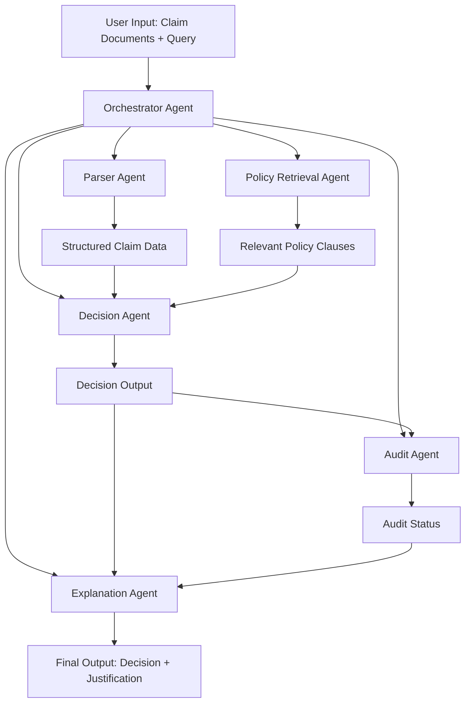

# **Multi-Agent Insurance Claim Decision System**

## **1. [[Overview]]**

This project presents a multi-agent AI system that automates insurance claim processing using structured workflows. Unlike traditional [[RAG]] systems, it employs specialized agents to perform parsing, retrieval, decision-making, validation, and explanation, ensuring accurate and auditable outcomes grounded strictly in policy documents.

---

## **2. Problem Statement**

Insurance claim processing is slow and inconsistent due to:

- Manual document review
    
- Complex policy interpretation
    
- Lack of transparency in decisions
    
- Limited auditability
    

---

## **3. Solution**

A coordinated multi-agent system where each agent performs a specific task in the claim evaluation pipeline. The system ensures deterministic, explainable, and document-grounded decisions.

---

## **4. Architecture**



---

## **5. Agent Roles**

- **Parser Agent**: Extracts structured data from documents
    
- **Policy Retrieval Agent**: Retrieves relevant clauses using vector search
    
- **Decision Agent**: Evaluates claim against policy
    
- **Audit Agent**: Validates logical and policy consistency
    
- **Explanation Agent**: Generates human-readable justification
    

---

## **6. Key Features**

- Multi-agent workflow with clear task separation
    
- Fully explainable decisions with supporting clauses
    
- Strict document grounding (no hallucination)
    
- Structured and human-readable outputs
    
- Extensible design for additional agents
    

---

## **7. Tech Stack**

- Agents: CrewAI / LangChain / AutoGen
    
- Models: LLaMA, Mistral, DeepSeek
    
- Backend: FastAPI
    
- Vector DB: FAISS
    
- Compute: AMD Developer Cloud (ROCm)
    

---

## **8. Sample Output**

```json
{
  "decision": "Rejected",
  "reason": "Claim exceeds coverage limit",
  "supporting_clauses": ["Clause 4.2"],
  "audit_status": "Valid"
}
```

---

## **9. Conclusion**

The system demonstrates a practical, production-oriented approach to agentic AI by transforming insurance claim processing into a structured, explainable, and scalable workflow.

## Connected Notes

- [[Overview]]
- [[RAG]]
